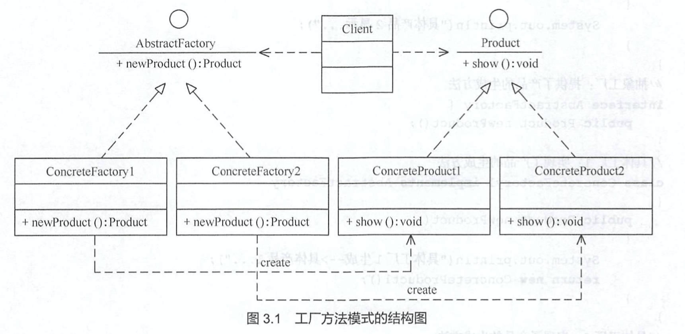
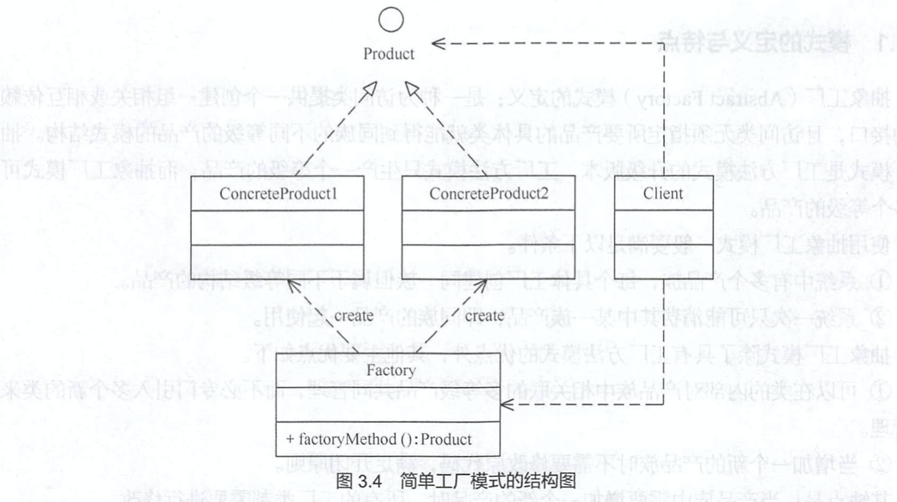
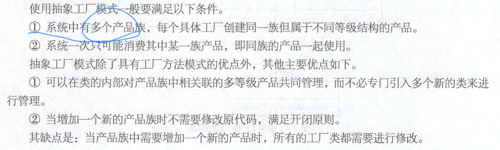
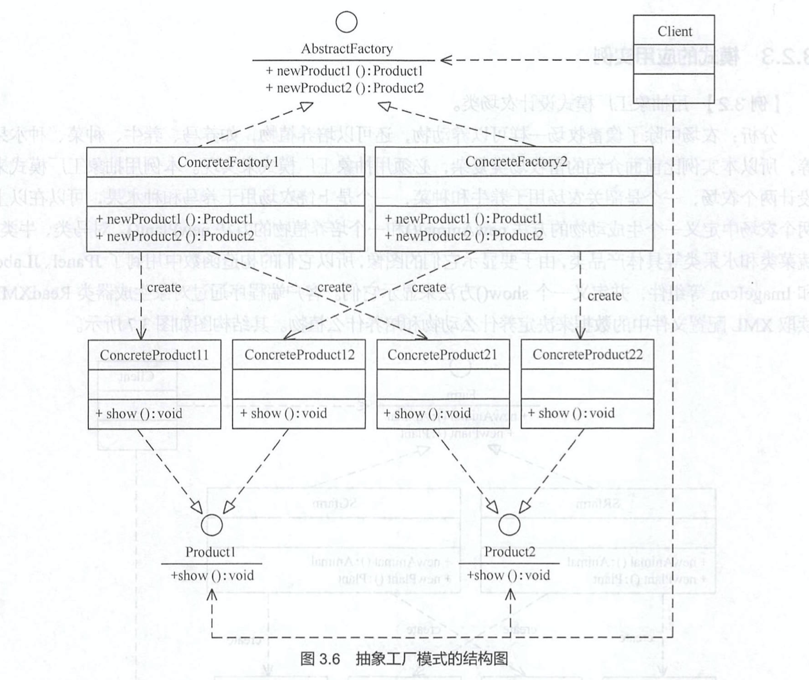

# 工厂设计模式学习

[TOC]

​		首先我们知道，按照目的来分呢，23种设计模式可以分为建造型模式、结构型模式和行为型模式。我们今天说的工厂设计模式属于建造型模式，工厂嘛，生产东西的，自然是建造者。那我们今天就从工厂设计模式的三个特例来学习下这个设计模式，到最后希望大家可以对工厂模式有一个深刻的理解。

## 1、 工厂方法模式

### 定义

> 定义一个产品对象的工厂接口，将产品对象的实际创建工作推迟到具体的子工厂类中。

### 特点

这满足创建型模式中所要求的**”创建与使用分离**“的特点，我们把被创建的对象叫做**”产品**”，把创建产品的对象叫做**“工厂**”，如果要创造的产品不多，只需要一个工厂可以完成，那就退化为了*简单工厂模式*，我们一会再说、

### 优点

1. 用户只需要知道工厂的名字就可以得到所要的产品，无需知道产品的具体生产过程
2. 在系统增加新的产品的时候，只需要添加产品类和对应的具体工厂类，无需对原工厂进行任何修改，满足**开闭原则**


### 缺点

每增加一个产品就要增加一个实现类和实现工厂，增加了系统的复杂度。

### 结构组成

* 抽象工厂（Abstract Factory）：提供了创建产品的接口，调用者通过它访问具体工厂的工厂方法`createProduct()`来创建产品。
* 具体工厂（Concrete Factory ）：主要是实现抽象工厂中的抽象方法，完成具体产品的创建。
* 抽象产品（Abstract Product）：定义了产品的规范，描述了产品的主要特征和功能
* 具体产品（Concrete Product）：实现了抽象产品角色所定义的接口，由具体的工程来创建，它同具体工厂之间一一对应。



### 实战

> 产品抽象类和实现类

```java
/**
 * 产品接口类：茶
 */
abstract class Tee {
    String NAME;
    int PRICE;
}

/**
 * 产品实现类：红茶
 */
@Data
class RedTee extends Tee {
    public RedTee(String n, int p) {
        NAME = n;
        PRICE = p;
    }
}

/**
 * 产品实现类：绿茶
 */
@Data
class GreenTee extends Tee {
    public GreenTee(String n, int p) {
        NAME = n;
        PRICE = p;
    }
}
```

> 工厂抽象类和实现类

```java
/**
 * 工厂类
 */
interface TeeFactory {
    /**
     * 生产Tee
     *
     * @return 返回Tee
     */
    Tee createTee();
}

/**
 * 工厂具体实现类：绿茶工厂
 */
class GreenTeeFactory implements TeeFactory {

    @Override
    public Tee createTee() {
        return new GreenTee("GreenTee", 8);
    }
}

/**
 * 工厂具体实现类：红茶工厂
 */
class RedTeeFactory implements TeeFactory {

    @Override
    public Tee createTee() {
        return new RedTee("RedTee", 9);
    }
}
```

> 测试

```java
@Slf4j
public class FactoryMethodDesignPattern {
    /**
     * 使用 Tee做例子
     *
     * @param args
     */
    public static void main(String[] args) {
        GreenTeeFactory greenTeeFactory = new GreenTeeFactory();
        Tee tee = greenTeeFactory.createTee();
        log.info("this is my " + tee);
        // 我们会发现，这样做了以后，比如我们要新加入茶的一个品类，比如 普洱茶
        // 我们只需要写一个Tee的实现类，然后 写一个 TeeFactory的实现类，PuErTeeFactory去生产普洱茶就行了
        // 代码比较容易拓展
    }
}
```


## 2、 简单工厂模式

> 可以说这是工厂方法模式的**一个特例**，因为当只有一个工厂的时候，可以用这个工厂去创建多种产品，也就可以把这些产品的生产放在一个方法中，工厂也就没有必要用实现类去创建产品，工厂方法也就变成了简单工厂模式。简单工厂不属于Gof23种设计模式，它的缺点是增加新产品会违背**开闭原则**

### 为什么会有简单工厂模式？

​		至于为什么单独拿出来说它，我们觉得可能是如果不需要生产过多产品，不需要频繁业务变更的情况下，用简单工厂模式的话，效率更高，代码更简洁，既然业务不变更，那也就不需要代码具有拓展性了，既然只有那些固定的业务，那也就没有必要用继承或者接口这种层级关系来拓展重用代码了，简单工厂可以很好的满足有这个想法的开发者。

### 结构图



### 实战

> 产品类

```java
/**
 * 产品类:咖啡
 */
abstract class Coffee {
    String NAME ;
    int PRICE;
}

/**
 * 产品实现类：猫屎咖啡
 */
class CatFecesCoffee extends Coffee {
    CatFecesCoffee(String n, int p) {
        NAME = n;
        PRICE = p;
    }
}

/**
 * 产品实现类，美式咖啡
 */
@Data
class AmericanoCoffee extends Coffee {
    AmericanoCoffee(String n, int p) {
        NAME = n;
        PRICE = p;
    }
}
/**
 * 产品，豆奶
 */
@Data
class SoyMilk{
    public String NAME;
    public int PRICE;
    SoyMilk(String n, int p){
        this.NAME = n;
        this.PRICE = p;
    }
}
```

> 工厂类

```java
/**
 * 工厂类
 */
@Slf4j
class CoffeeFactory {
    /**
     * 一个工厂可以生成多个产品
     * @param name 产品名称
     * @return 做好的产品
     */
    public Object createCoffee(String name) {
        switch (name) {
            case "CatFecesCoffee":
                log.info("ye,this is your CatFecesCoffee!");
                return new CatFecesCoffee("CatFecesCoffee", 15);
            case "AmericanoCoffee":
                log.info("ye,this is your AmericanoCoffee!");
                return new AmericanoCoffee("AmericanoCoffee", 17);
            case "SoyMilk":
                log.info("ye,this is your SoyMilk!");
                return new SoyMilk("SoyMilk", 10);
            default:
                log.error("sorry, we just have this two coffee!");
                break;
        }
        return null;
    }
}

```

> 测试

```java
@Slf4j
public class SimpleFactoryDesignPattern {
    /**
     * 用咖啡来举例子
     *
     * @param args
     */
    public static void main(String[] args) {
        // 创建工厂
        CoffeeFactory coffeeFactory = new CoffeeFactory();
        // 创建 Coffee
        Coffee myCoffee = (Coffee)coffeeFactory.createCoffee("AmericanoCoffee");
        log.info("this is my "+myCoffee);
        // 但是我们会发现，如果我要拓展品类，我想要引入新的咖啡种类，或者添加新的产品线，比如红茶等，
        // 都需要对工厂类进行修改，不利于代码的可重用性、拓展性和易修改性，所以我们引入了工厂方法
    }
}

```


## 3、抽象工厂方法模式


前面介绍的工厂方法模式中考虑的是一类产品的生产，如畜牧场只养动、电视机厂只生产电视机等。同种类成为同等级，也就是说，工厂方法模式只考虑了生产同等级的产品，但是现实生活中又有很多工厂可以生产很多不同等级的产品。

> 抽象工厂在工厂方法模式的基础上，将一个具体的工程所生产的位于不同等级的一组产品叫做一个**产品簇**。

### 定义

> 抽象工厂模式是一种为访问类提供一个创建一组相关或者相互依赖对象的接口，且访问类无需指定所哟啊产品的具体类就能获得同族的不同等级的产品。

抽象工厂模式是工厂方法模式的升级版本，工厂方法模式一个工厂只能生产一个产品，抽象工厂可以生成多个。

### 抽象工厂模式要满足的条件



### 模式结构

* 抽象工厂（Abstract Factory）：提供了创建产品的接口，可以使用多个产品的制作方法`createProduct()`来创建产品。
* 具体工厂（Concrete Factory ）：主要是实现抽象工厂中的多个抽象方法，完成具体产品的创建。
* 抽象产品（Abstract Product）：定义了产品的规范，描述了产品的主要特征和功能，抽象工厂模式有多个抽象产品
* 具体产品（Concrete Product）：实现了抽象产品角色所定义的接口，由具体的工程来创建，它同具体工厂之间是**多对一的关系**。



### 实现

> 产品类

```java

```

