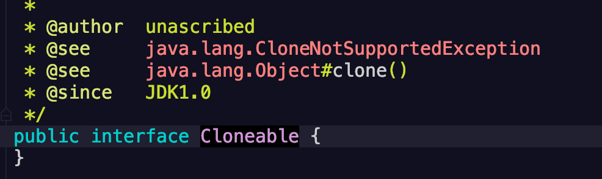
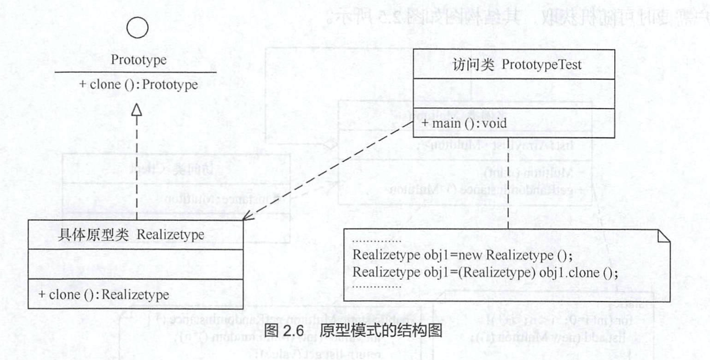

# 原型设计模式 

[TOC]

有些系统中存在**大量相同的或相似的对象创建问题**，如果使用传统的构造器创建对象，会比较复杂，且耗时资源，用原型模式生成对象，就很高效。

## 模式的定义

定义：

> 用一个*已经创建的实例作为原型*，通过**复制该原型**，创建一个**跟该原型** *相同或者相似*的**新对象** 。

## 模式的特点

* 原型实例：指定了要创建对象的种类
* 用这种方式创建对象**非常高效**，用这种方式创建对象根本**无需知道对象的具体细节**

例如：windows安装非常费时，如果复制就快了很多。

## 模式的结构

由于java从jdk1.0开始就提供了clone方法，所以java的原型模式实现非常简单。Java里面的Cloneable接口就是抽象原型类，里面其实没有什么，就是一个标注，表明当前类支持克隆，也就是原型复制操作)



原型模式的结构包含以下角色：

* **抽象原型类**：规定了具体原型必须要实现的接口
* **具体原型类**：*实现*了抽象原型类的*clone方法*，它是可被复制的对象。
* **访问类**：*使用*具体原型类中的*clone方法*，访问新的对象。



## 模型的实现

> 具体原型类

```java
// 抽象原型类
@SLf4j
public class Realizetype implements Cloneable{
    public Realizetype(){
        // do somethings 
    }
    @Override
    public Object clone throw CloneNotSupportedException{
        log.info("具体原型复制成功！");
   		return (Realizetype)super.clone();
    } 
}

```

> 访问类

```java
@Slf4j
public class PrototypeTest {
    public static void main(String[] args) throws CloneNotSupportedException {
        Realizetype obj1 = new Realizetype();
        Realizetype obj2 = (Realizetype)obj1.clone();
        log.info("obj1==obj2? " + (obj1 == obj2));
    }
}
```

## 原型模式的应用

* 比如说要指定一个票据，票据对应不同的商品，商品的特征在票据上的体现就是商品名称、种类、重量、售价的不同，所以我们可以用原型设计模式，把不同商品的票据clone出来
* 用这个例子举一反三，我们保留原型模式的目的就是因为，重新构造对象的代价太高了，所以想通过克隆的方式，减少创建对象的步骤和开销，前提是，两个目标之间**相同或者相似**。

