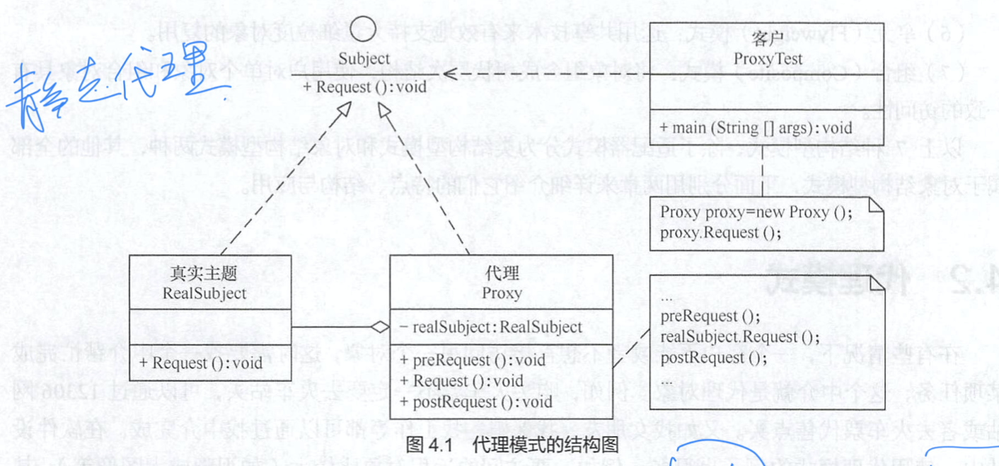
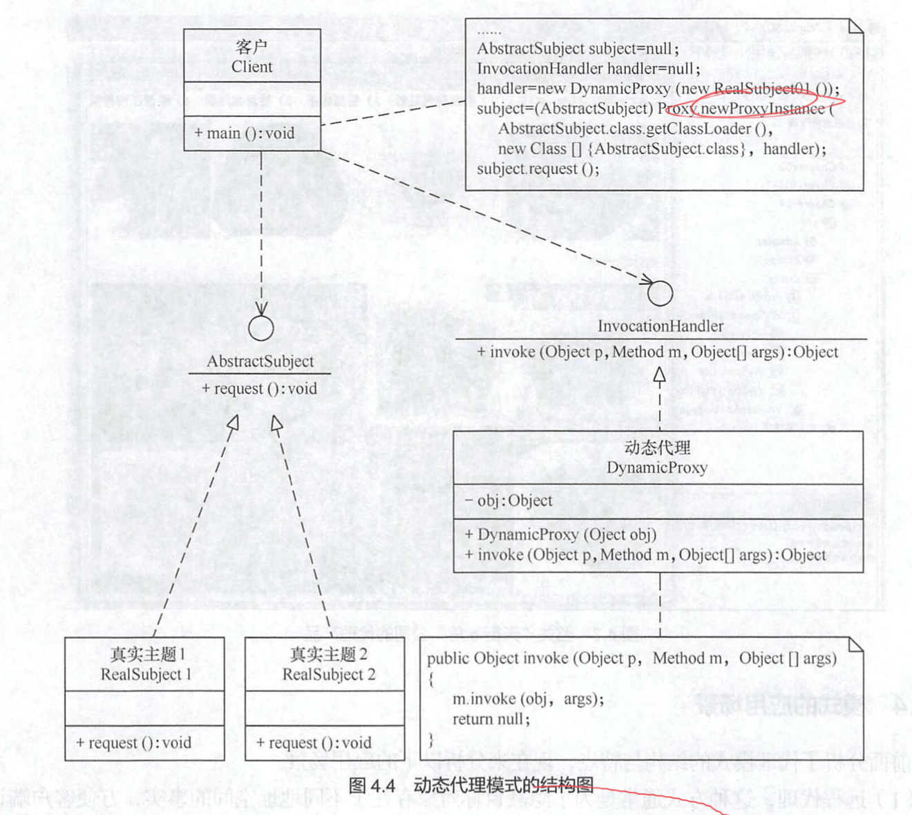
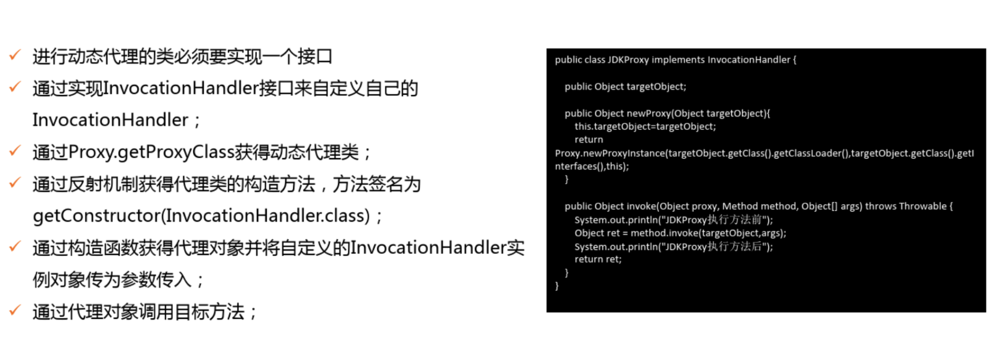
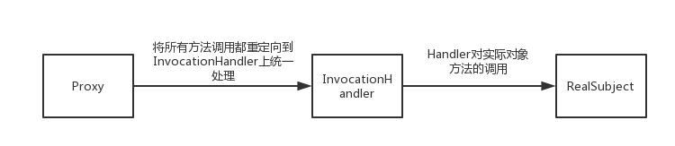
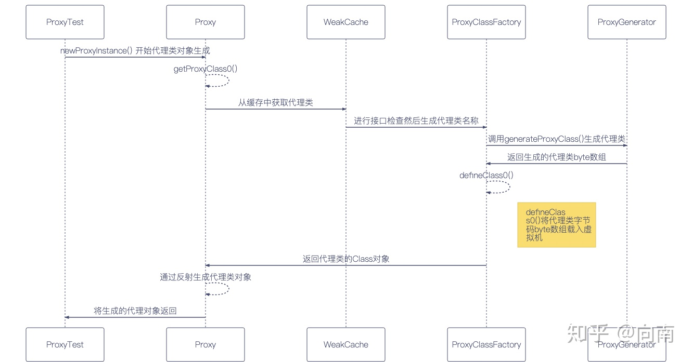
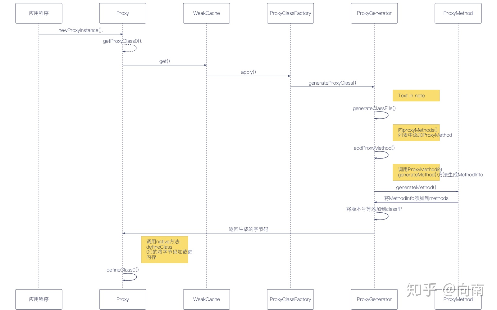

# 代理设计模式

[TOC]


​		在有些情况下，客户不想直接访问某一个对象，这时候需要一个**中间对象**来帮助完成某个任务，这个中间对象就是==代理对象==。比如，你结婚，办婚礼，不是你在办婚礼，是别人在替你办婚礼，你只是参加婚礼而已，这个代办人，就是婚礼中介，也就是代理模式的体现。生活中还有很多地方用到了代理模式，希望大家好好体会。


## 代理模式的定义

> ​		由于某些原因，需要给对象提供一个代理，以**控制该对象的==访问==**，这时，访问对象**不适合**或者**不能** *直接引用目标对象*，代理对象作为访问对象和目标对象之间的中介。

代理模式在java实现来，有两种：

1. **静态代理**
2. **动态代理（jdk，CGlib）**

## 代理模式的优点

1. 代理模型在目标对象和客户端之间架起了**一座桥梁**，起到了**保护目标对象的作用**；
2. 代理对象可以**拓展目标的功能**；
3. 代理对象将客户端与目标对象的**使用分离**，一定程度上**降低了耦合度**。

## 代理模式的缺点

1. 在客户端与目标对象之间承载了调用关系，相当于加了一层调用，会造成使用**性能的下降**
2. **增加了系统的复杂度**

## 静态代理模式的结构

静态代理比较简单，是通过继承抽象类，内置目标对象，对目标对象进行代理的。

主要包含以下角色：

1. **抽象主题**（Subject）：可以通过接口或者抽象类，声明真实主题和代理对象之间的业务方法（也就是代理类和目标类之间公共方法）
2. **真实主题类**（Real Subject）：实现了抽象主题中的具体任务，是目标对象，是代理对象所要代理的真实对象
3. **代理类**（Proxy）：代理目标对象，通过和目标对象实现同一个接口或者抽象类，来 获取相同的方法，以至于可以通过内置的目标对象调用其对应方法，并返回
4. **客户端**（Client）：希望使用真实对象（目标对象），不能或者不适合直接使用，而转向调用其代理类




## 静态代理的实现

> 抽象主题接口：提供不能直接调用的方法的抽象

```java
// 这里选的是 代购 的例子
public interface Buy {
    /**
     * 购物
     * @param goodName
     */
    void buy(String goodName);
}
```

> 真实 主题接口：直接购买

```java
/**
 * 直接购物
 */
@Slf4j
public class Shopping implements Buy {
    /**
     * 购物：先付款，再购买
     * @param goodName
     */
    @Override
    public void buy(String goodName) {
        log.info("付款");
        log.info("购买了:" + goodName);
    }
}
```

> 代理类：代理购物

```java
/**
 * 代理购物
 */
@Slf4j
public class ShoppingProxy implements Buy {

    // 内置了  购物
    private Shopping buyer;

    /**
     * 代理购物 方法
     * @param goodName
     */
    @Override
    public void buy(String goodName) {
        if (buyer == null){
            buyer = new Shopping();
        }
        preBuyer();  // 做一些前置工作，比如出国
        buyer.buy(goodName);    ///-------------------代理执行
        postBuyer(); // 做一些后置工作，带回国
    }

    /**
     * 做一些预处理，加入购物车等等(拓展)
     */
    private void preBuyer() {
        log.info("出国");
        log.info("选购");
        log.info("加入购物车");
    }

    /**
     * 做一些后置处理(拓展)
     */
    private void postBuyer() {
        log.info("取快递");
    }
}
```

> 客户端：想要 购物的人

```java
@Slf4j
public class ABuyer {

    /**
     * 一个购买者想要买东西：
     * @param args
     */
    public static void main(String[] args) {
        // 但是直接买亚马逊上的，买不了,没法访问
            /** Shopping shop = new Shopping();
             *  shop.buy();
             */
        // 所以只能找人出国代买，这个人就是代理
        ShoppingProxy shoppingProxy = new ShoppingProxy();
        shoppingProxy.buy("milk");
        /** 结果：
         * 出国
         * 选购
         * 加入购物车
         * 付款
         * 购买了:milk
         * 取快递
         */
    }
}
```

## 静态代理的弊端

* 真实主题与代理对象之间一一对应，每新增一个真实主题，就要配置一个代理
* 静态代理不能脱离真实主题而被创造，具有很强的耦合度

> 解决办法：采用**动态代理**可以解决这个问题！！！

## 动态代理的组成结构

* 抽象主题（Abstract Subject): 提供抽象的真实方法
* 真实主题（Real Subject）：提供方法的实现
* 调用管理器接口（invocationHandler): 实现了这个接口的类，需重写`invoke`方法
* 调用管理器（DynamicProxy）：内置对象，实现抽象代理接口，重写了`invoke`方法
* 客户端：通过`Proxy.newProxyInstance()`方法，把对应代理类和目标类实现的类加载器、接口、以及代理对象传入，即可在运行期间，帮我们在JVM内存中动态生成代理类，代理执行对应方法
* 代理类：在内存中动态生成的，实现了抽象主题接口的类




## 动态代理的实现方法

`newProxyInstance()`方法主要以下三个参数

- 类加载器(ClassLoader)用来加载动态代理类
- 一个要实现接口的数组，从这点就可以看出，要想**使用JDK动态代理，必须要有接口类**
- InvocactionHandler接口的一个实现




## 动态代理的实现原理





图片来源：https://zhuanlan.zhihu.com/p/60288881



**具体原理**请看这篇文章：https://zhuanlan.zhihu.com/p/60288881


## 动态代理的使用

> 抽象主题接口：提供不能直接调用的方法的抽象

```java
// 这里选的是 代购 的例子
public interface Buy {
    /**
     * 购物
     * @param goodName
     */
    void buy(String goodName);
}
```

> 真实 主题接口：直接购买

```java
/**
 * 直接购物
 */
@Slf4j
public class Shopping implements Buy {
    /**
     * 购物：先付款，再购买
     * @param goodName
     */
    @Override
    public void buy(String goodName) {
        log.info("付款");
        log.info("购买了:" + goodName);
    }
}
```

> 代理处理类

```java
@Slf4j
public class DynamicShoppingProxy  implements InvocationHandler {

    private Buy buy;

    public DynamicShoppingProxy(Buy buy) {
        this.buy = buy;
    }

    @Override
    public Object invoke(Object proxy, Method method, Object[] args) throws Throwable {
        log.info("出国");
        log.info("选购");
        log.info("加入购物车");
        Object invoke = method.invoke(buy,args);
        log.info("取快递");
        return invoke;
    }
}
```

> 客户类

`````java
@Slf4j
public class ABuyer {
    /**
     * 一个购买者想要买东西：
     *
     * @param args
     */
    public static void main(String[] args) {
        // 但是直接买亚马逊上的，买不了,没法访问
        /** Shopping shop = new Shopping();
         *  shop.buy();
         */
        // 所以只能找人出国代买，这个人就是代理

        // 1. 类加载器
        ClassLoader classLoader = Shopping.class.getClassLoader();
        // 2. 所有接口
        Class<?>[] classes = Shopping.class.getInterfaces();
        // 3. 调用处理类
        DynamicShoppingProxy dynamicProxy = new DynamicShoppingProxy(new Shopping());
        // 生成并返回的 代理对象
        Buy buy = (Buy) Proxy.newProxyInstance(classLoader, classes, dynamicProxy);
        // 让代理对象执行buy方法
        buy.buy("milk");


        // lambda表达式的方式
        Buy buy2 = (Buy)Proxy.newProxyInstance(Shopping.class.getClassLoader(),
                Shopping.class.getInterfaces(),
                (a, b, c) -> b.invoke(new Shopping(), c)
        );
        buy2.buy("iPhone12 Pro Max");
        /**
         * 出国
         * 选购
         * 加入购物车
         * 付款
         * 购买了:milk
         * 取快递
         */
    }
}
`````

## 参考文章

https://zhuanlan.zhihu.com/p/60288881