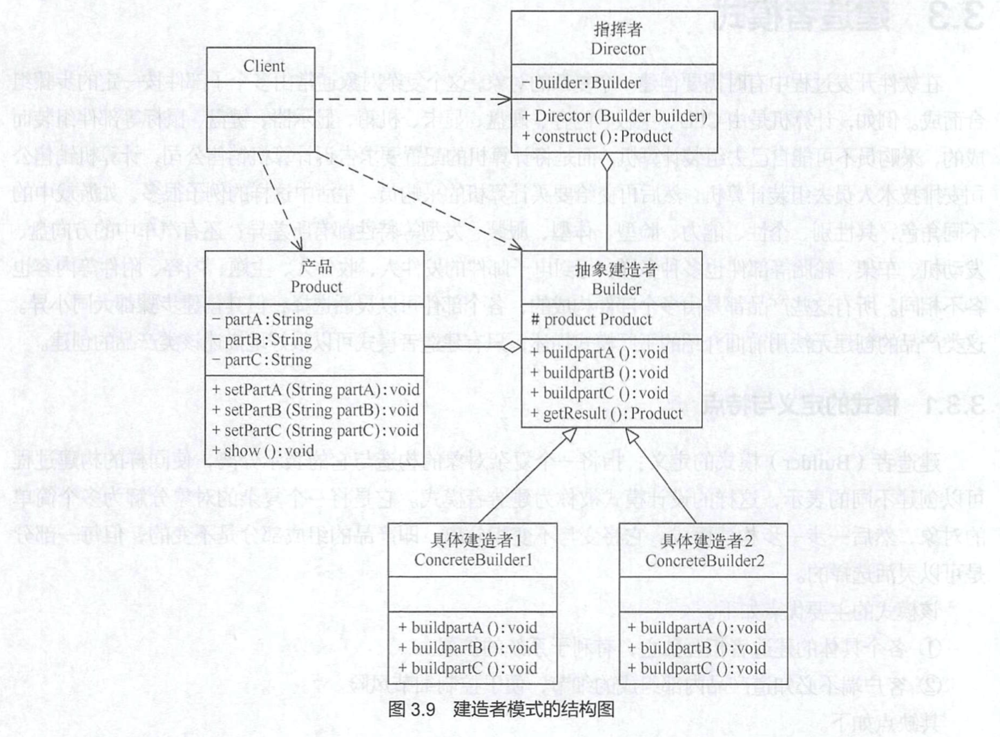

# 建造者设计模式

[TOC]

​		在软件开发中，我们有时候可能会遇到要创建一个复杂的对象，这个复杂对象可能需要很多不同的子组件按照一定的步骤组成。比如PC就是由，机箱、主板、cpu、显卡、主线、开机排线、显示屏、电源、输入输出设备、内存条、固态硬盘、机械硬盘组成的，一般非极客是不会自己买这些部件的，大概率是买一个成品，那不同厂家的电脑组装就有不同从制作流程，这就可以称之为一个复杂的构建过程。

​		其核心在于，组成对象的成分大同小异，各子部件可以随意更换选择，这种产品 的创建无法用我们前几天学的工厂模式来构造，只有今天学习的建造者模式（builder）才可以很好的构建这种对象。

##建造者模式的定义

> **将一个对象的构建与显示分离**，**使同样的构建过程可以创建不同的显示**，这种设计模式可以叫做 **建造者模式** *（builder）*。

* 它是将一个**复杂对象的构建分解成多个简单的对象**，然后一步一步构建而成的。

* 它将**变与不变相分离**，即产品的**组成部分是不变**的，但**每一部分都是可以灵活选择**的。

## 建造者模式的优点

* 建造者模式各个模式的建造者**相互独立，很容易进行扩展**。如果有新的需求，通过实现一个新的建造者类就可以完成，基本上不用修改之前已经测试通过的代码，因此也就不会对原有功能引入风险。符合开闭原则。

* 客户端**不需要知道对象的内部构建细节**，便于控制细节的风险将产品本身与产品的创建过程解耦，使得相同的创建过程可以创建不同的产品对象。
* 建造者模式的**封装性很好**。使用建造者模式可以有效的封装变化，在使用建造者模式的场景中，一般产品类和建造者类是比较稳定的，因此，将主要的业务逻辑封装在导演类中对整体而言可以取得比较好的稳定性。
* 可以更加**精细地控制产品的创建过程** 。将复杂产品的创建步骤分解在不同的方法中，使得创建过程更加清晰，也更方便使用程序来控制创建过程。

## 建造者模式的缺点

* **产品组成部分必须相同**，这也限制了建造者模式的应用范围
* 如果产品内部结构复杂，会增加很多的建造者类

## 建造者模式 & 工厂模式

* 建造者模式*注重零部件的组装*，工厂模式*注重零部件的创建过程*
* 所以二者可以联合使用，工厂提供零部件的制作，建造者模式提供零部件的组装，生成完整的对象

## 建造者模式的组成和架构

建造者模式由*产品*、*抽象建造者*、*具体建造者*、*指挥者*这四部分组成：

* 产品（Product）：复杂产品对象，由构造者来制作它的多个部件
* 抽象建造者（Builder）：它是一个包含创建产品各个子部件方法的抽象接口。通常还包含最后的返回最终成型对象的方法`getResult()`。
* 具体建造者（Concrete Builder）：实现了抽象建造者接口，完成对象的具体创建步骤
* 指挥者（Director）：它调用建造者中的部件构造装配方法完成复杂对象的构建，注意：在指挥者中不涉及具体产品的信息。




## 建造者模式的实现

> 产品类

```java
@Data
@ToString
public class Computer {
    private String displayScreen;
    private String CPU;
    private String GPU;
    private String RAM;
    private String HardDisk;
    private String IOEquip;
}
```


> 抽象构建类

```java
/**
 * 抽象构造者
 */
abstract class AbstractBuilder {
    Computer computer = new Computer();

    abstract void buildDisplayScreen();
    abstract void buildCPU();
    abstract void buildGPU();
    abstract void buildHardDisk();
    abstract void buildRAM();
    abstract void buildIOEquip();

    abstract Computer getResult();
}
```


> 具体构建类1

```java
/**
 * 具体构建者
 */
public class MacBookPro extends AbstractBuilder {
    @Override
    void buildDisplayScreen() {
        computer.setDisplayScreen("LG 2560x1440 HDR SGRB 120% 650nt");
    }
    @Override
    void buildCPU() {
        computer.setCPU("RAM m1 cpu 8 core");
    }
    @Override
    void buildGPU() {
        computer.setGPU("RAM m1 gpu 8 core");
    }
    @Override
    void buildHardDisk() {
        computer.setHardDisk("1T SSD");
    }
    @Override
    void buildRAM() {
        computer.setRAM("32GB DDR5");
    }
    @Override
    void buildIOEquip() {
        computer.setIOEquip("4 Thunderbolt 3 & " +
                "Scissor keyboard");
    }
    @Override
    Computer getResult() {
        return computer;
    }
}
```

> 具体构建类2

```java
/**
 * 具体构建者
 */
public class LenovoY9000X extends AbstractBuilder {

    @Override
    void buildDisplayScreen() {
        computer.setIOEquip("2K IPS SRGB 100%");
    }

    @Override
    void buildCPU() {
        computer.setCPU("i7 10875H");
    }

    @Override
    void buildGPU() {
        computer.setGPU("xxx");
    }

    @Override
    void buildHardDisk() {
        computer.setHardDisk("1T SSD");

    }

    @Override
    void buildRAM() {
        computer.setRAM("32GB DDR5");
    }

    @Override
    void buildIOEquip() {
        computer.setIOEquip("lenovo keyboard 2 Thunderbolt");

    }

    @Override
    Computer getResult() {
        return computer;
    }
}
```

> 指挥者

```java
/**
 * 指挥者
  */
public class Director {
    private AbstractBuilder builder;

    public Director(AbstractBuilder builder){
        this.builder = builder;
    }

    public Computer construct(){
        builder.buildDisplayScreen();
        builder.buildCPU();
        builder.buildGPU();
        builder.buildHardDisk();
        builder.buildIOEquip();
        builder.buildRAM();
        return builder.getResult();
    }
}
```

> 客户端

```java
/**
 * 客户端
 */
public class Client {
    public static void main(String[] args) {
        // 1. 找指挥部 表明 购买的意向
        Director director = new Director(new MacBookPro());
        // 2. 指挥部 制作 电脑，内部细节隐藏
        Computer myComputer = director.construct();
        // 3. 展示电脑 各部件配置
        System.out.println(myComputer.toString());
        // Computer{displayScreen='LG 2560x1440 HDR SGRB 120% 650nt',
        //          CPU='RAM m1 cpu 8 core',
        //          GPU='RAM m1 gpu 8 core',
        //          RAM='32GB DDR5',
        //          HardDisk='1T SSD',
        //          IOEquip='4 Thunderbolt 3 & Scissor keyboard'}
    }
} 
```
