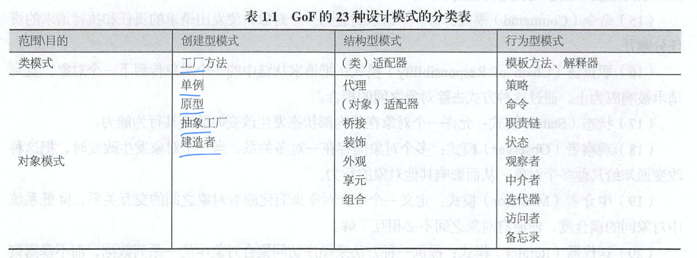
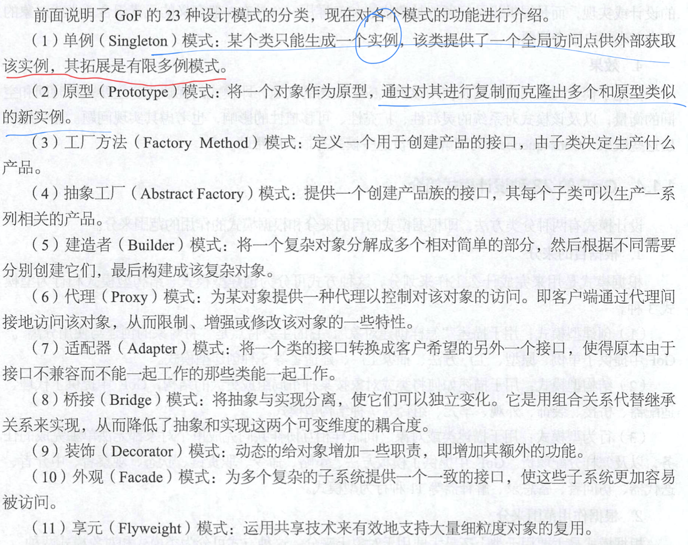
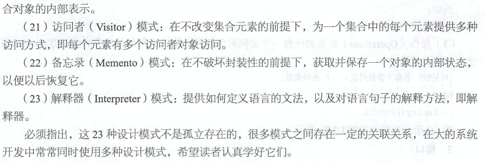

# 设计模式总览

[TOC]

​		本篇文章主要是想了解下设计模式的由来和设计模式的分类，毕竟经过了前人的总结，在代码，模块，逻辑结构的设计方面，设计模式可以说是圣经了。

一天一个设计模式走起！

## 软件设计模式的定义

​		**软件设计模式即*（Software Design Pattern）* **。又称==设计模式==，是一套被**反复利用**、**多数人知晓的**、**经过分类编目的**、**代码设计经验的总结**。

这个定义我们着重记录下：

* 被反复利用
* 多数人知晓的
* 经过分类编目的
* 代码设计经验的总结

> 它描述了在软件设计过程中的一些不断重复发生的问题，以及该问题的解决方案。

## Gof23种设计模式分类

1、根据目的来分

* **创造型模式**：用于描述==怎样创建对象==，它的主要特点是“将对象的创建和使用分离“，Gof中提供了单例、原型、工厂方法、抽象工厂、建造者等5种创建型模式。
* **结构型模式**：用于描述==如何将类或者对象按照某种布局组成更大的结构==，Gof中提供了代理、适配器、桥接、装饰、外观、享元、组合等七种结构型模式。
* **行为型模式**：用于描述==类或对象之间怎样相互协作共同完成单个对象都无法单独完成的任务，以及怎样分配职责==。Gof中提供了模板方法、策略、命令、责任链、状态、观察者、中介者、迭代器、访问者、备忘录、解释器等11种行为型模式。

2、根据作用范围来分、根据模式是主要用语言类上还是主要用于对象上来分，可分为**类模式**和**对象模式**两种：

* **类模式**：用于处理类与之类之间的关系，这些关系是通过继承来建立的，是静态的，在编译时就确定下来了。Gof中的工程方法，（类）适配器，模板方法，解释器属于该模式
* **对象模式**：用于处理对象之间的关系，这些关系可以通过组合和聚合来实现，在运行时刻是可以变化的，根据动态性。Gof中除了上这四种，其他都属于对象模式。

## 23种设计模式的说明

